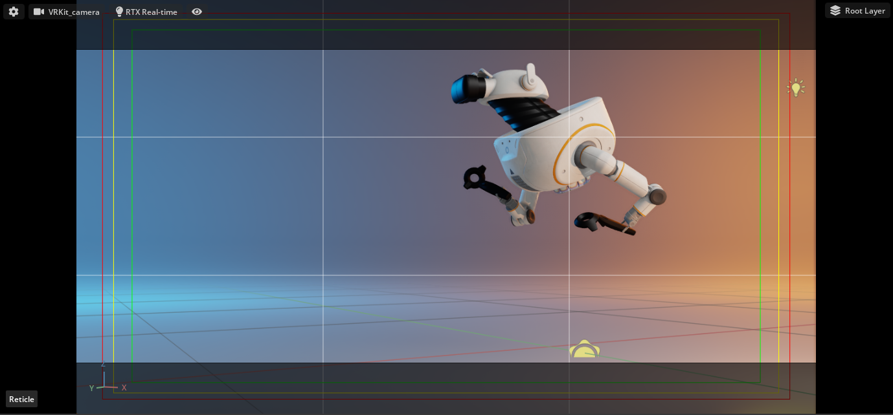
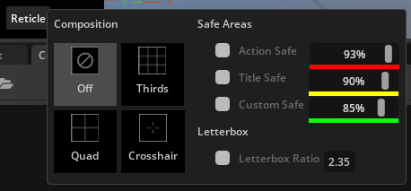

# Viewport Reticle Sample Kit Extension

The Camera Reticle extension adds a new menu button to all viewports. From this menu, users can enable and configure:
1. Composition Guidelines
2. Safe Area Guidelines
3. Letterbox

I created this to learn and test the Kit SDK. To have a clear design target, I designed the UI as a look-alike of 
the similar Unreal Engine Cinematic Viewport control. Even though this was just a test, feel free to use this
extension to help compose your shots or as an example to learn from.

## Adding This Extension

To add a this extension to your Omniverse app:
1. Go into: Extension Manager -> Gear Icon -> Extension Search Path
2. Add this as a search path: `git://github.com/NVIDIA-Omniverse/sample-kit-extension-reticle?branch=main&dir=exts`