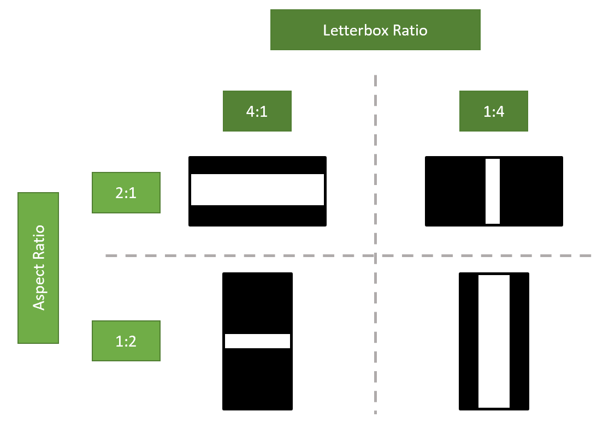

# Create a Reusable Reticle with Omniverse Kit Extensions

Camera [reticles](https://en.wikipedia.org/wiki/Reticle) are patterns and lines rendered in order to provide a reference to users for how a camera lines up with the scene to be filmed. In this guide, we will learn how to make a reticle tool that can be used across multiple Omniverse projects.

## Learning Objectives

In this guide, we will learn how to:
* Draw a line on top of a [viewport](https://docs.omniverse.nvidia.com/app_create/prod_extensions/ext_viewport.html)
* Divide the viewport with multiple lines
* Create a crosshair and letterboxes

## Table of Content
1. [Download the Starter Project](#1-download-the-starter-project)
2. [Drawing a Single Line](#2-drawing-a-single-line)
3. [Drawing a Quad](#3-drawing-a-quad)
4. [Drawing Thirds](#4-drawing-thirds)
5. [Drawing a Crosshair](#5-drawing-a-crosshair)
6. [Drawing Safe Area Rectangles](#6-drawing-safe-area-rectangles)
7. [Drawing Letterboxes](#7-drawing-letterboxes)
8. [Congratulations!](#8-congratulations)

## Prerequisites
It is recommended to understand th concepts in the following tutorials before proceeding:
* How to make an extension by spawning primitives ([Link](https://github.com/NVIDIA-Omniverse/sample-kit-extension-spawnPrims/blob/main/exts/omni.example.spawnPrims/tutorial/Spawn_PrimsTutorial.md))


## 1. Download the Starter Project
To get the assets for this hands-on lab, please clone the `tutorial-start` branch of `sample-kit-extension-reticle` [github repository](https://github.com/NVIDIA-Omniverse/sample-kit-extension-reticle/tree/tutorial-start). 

`git clone -b tutorial-start https://github.com/NVIDIA-Omniverse/sample-kit-extension-reticle.git`

This tutorial will focus on the `views.py` file found in the`exts/omni.sample.reticle/omni/sample/reticle/` directory. To learn more about the other files in the repository, please check the < basic how to build an extension tutorial >.

In particular, we will be focusing on the `build_viewport_overlay` function. It should look something like this:

```python
    def build_viewport_overlay(self, *args):
        """Build all viewport graphics and ReticleMenu button."""
        if self.vp_win is not None:
            self.vp_win.frame.clear()
            with self.vp_win.frame:
                with ui.ZStack():
                    # Set the aspect ratio policy depending if the viewport is wider than it is taller or vice versa.
                    if self.vp_win.width / self.vp_win.height > self.get_aspect_ratio_flip_threshold():
                        self.scene_view = scene.SceneView(aspect_ratio_policy=scene.AspectRatioPolicy.PRESERVE_ASPECT_VERTICAL)
                    else:
                        self.scene_view = scene.SceneView(aspect_ratio_policy=scene.AspectRatioPolicy.PRESERVE_ASPECT_HORIZONTAL)

                    # Build all the scene view guidelines
                    ...

```

Let's break down what is happening so far. 
* `self.vp_win` is the [viewport](https://docs.omniverse.nvidia.com/app_create/prod_extensions/ext_viewport.html) we will be building the overlay on top of. If there is no viewport, there's nothing to build on top of, so we'll stop the function here.

* If we do have a viewport, we will create a clean slate by calling [clear](https://docs.omniverse.nvidia.com/py/kit/source/extensions/omni.ui/docs/index.html#omni.ui.Container.clear) on the [frame](https://docs.omniverse.nvidia.com/py/kit/source/extensions/omni.ui/docs/index.html#omni.ui.Frame).

* Next, we will create a [ZStack](https://docs.omniverse.nvidia.com/py/kit/source/extensions/omni.ui/docs/index.html#omni.ui.Stack) which is a type of [Stack](https://docs.omniverse.nvidia.com/py/kit/source/extensions/omni.ui/docs/index.html#omni.ui.Stack) where elements are ordered along the Z direction (forwards and backwards from the camera, as opposed to up and down, or left and right).

* After that, we will create a [SceneView](https://docs.omniverse.nvidia.com/py/kit/source/extensions/omni.ui.scene/docs/index.html#omni.ui_scene.scene.SceneView) which is the widget that renders the [Scene](https://docs.omniverse.nvidia.com/py/kit/source/extensions/omni.ui.scene/docs/index.html#omni.ui_scene.scene.Scene). When doing this, we will need to do a little math to determine what the appropriate `aspect_ratio_policy`, which defines how to handle a [Camera](https://docs.omniverse.nvidia.com/app_create/prod_materials-and-rendering/cameras.html) with an aspect ratio different than the SceneView. The SceneView does not consider non-rendered areas such as [letterboxes](https://en.wikipedia.org/wiki/Letterboxing_(filming)), hence the `get_aspect_ratio_flip_threshold` function.

Further down in the `build_viewport_overlay` function, there are a number of `if` statements:

```python
                    with self.scene_view.scene:
                        if self.model.composition_mode.as_int == CompositionGuidelines.THIRDS:
                            self._build_thirds()
                        elif self.model.composition_mode.as_int == CompositionGuidelines.QUAD:
                            self._build_quad()
                        elif self.model.composition_mode.as_int == CompositionGuidelines.CROSSHAIR:
                            self._build_crosshair()

                        if self.model.action_safe_enabled.as_bool:
                            self._build_safe_rect(self.model.action_safe_percentage.as_float / 100.0,
                                                  color=cl.action_safe_default)
                        if self.model.title_safe_enabled.as_bool:
                            self._build_safe_rect(self.model.title_safe_percentage.as_float / 100.0,
                                                  color=cl.title_safe_default)
                        if self.model.custom_safe_enabled.as_bool:
                            self._build_safe_rect(self.model.custom_safe_percentage.as_float / 100.0,
                                                  color=cl.custom_safe_default)
                        if self.model.letterbox_enabled.as_bool:
                            self._build_letterbox()

                    # Build ReticleMenu button
                    with ui.VStack():
                        ui.Spacer()
                        with ui.HStack(height=0):
                            ui.Spacer()
                            self.reticle_menu = ReticleMenu(self.model)
```

These are the different modes and tools the user can select from the `ReticleMenu`. We will be constructing each of the `self.build_...` functions throughout this tutorial.

Let's first begin by learning how to draw a line.

## 2. Drawing a Single Line

### 2.1 Theory

Let's first learn how to draw a line. We can then use these lines to construct more complex shapes such as splitting the viewport into quads or thirds.

At the top of `reticle.py` is a `from omni.ui import scene` import statement. This [omni.ui.scene module](https://docs.omniverse.nvidia.com/py/kit/source/extensions/omni.ui.scene/docs/index.html) contains a number of useful classes including the [Line](https://docs.omniverse.nvidia.com/py/kit/source/extensions/omni.ui.scene/docs/index.html#omni.ui_scene.scene.Line) class. To create a line, we can provide a start, stop, and color like so:

```python
from omni.ui import color as cl

start_point = [0, -1, 0] # [x, y, z]
end_point = [0, 1, 0]
line_color = cl.white
scene.Line(start_point, end_point, color=line_color)
```
### 2.1 Practice

**CHALLENGE (optional):** Try adding a line to the `build_viewport_overlay` function within the `with self.scene_view.scene` statement. Also try altering the starting_point and end_point values to see how it renders in the Omniverse app. Please remove the line after exploring how it works.

## 3. Drawing a Quad

### 3.1 Theory

Now that we know how to draw a line, let's create a function to construct a Quad. In other words, let's break the view into fourths like so:


To do this, we'll build a function that looks like this:

```python
def _build_quad(self):
    """Build the scene ui graphics for the Quad composition mode."""
    aspect_ratio = self.get_aspect_ratio()
    line_color = cl.comp_lines_default
    inverse_ratio = 1 / aspect_ratio
    if self.scene_view.aspect_ratio_policy == scene.AspectRatioPolicy.PRESERVE_ASPECT_VERTICAL:
        scene.Line([0, -1, 0], [0, 1, 0], color=line_color)
        scene.Line([-aspect_ratio, 0, 0], [aspect_ratio, 0, 0], color=line_color)
    else:
        scene.Line([0, -inverse_ratio, 0], [0, inverse_ratio, 0], color=line_color)
        scene.Line([-1, 0, 0], [1, 0, 0], color=line_color)
```

To build a quad, we only need to divide the screen twice, so why are there four sets of lines here? Let's say the aspect ratio can grow and shrink in the horizontal direction, but the vertical height is static. That would preserve the vertical aspect ratio as with [scene.AspectRatioPolicy.PRESERVE_ASPECT_VERTICAL](https://docs.omniverse.nvidia.com/py/kit/source/extensions/omni.ui.scene/docs/index.html#omni.ui_scene.scene.AspectRatioPolicy.PRESERVE_ASPECT_VERTICAL). 

In this case, a vertical position in the viewport is bound between -1 and 1, but the horizontal position bounds are determined by the aspect ratio.

Conversely, if our horizontal width bounds are static and the vertical height bounds can change, we would need the inverse of the aspect ratio (`inverse_ratio`).

### 3.2 Practice
**TODO:** Currently, the `_build_quad` function in `views.py` has not been implemented:

```python
def _build_quad(self):
    """Build the scene ui graphics for the Quad composition mode."""
    # TODO: Put quad composition guidelines logic here
    pass
```

Please replace it with the code in the `3.1 Theory`.

## 4. Drawing Thirds

### 4.1 Theory

The [Rule of Thirds](https://en.wikipedia.org/wiki/Rule_of_thirds) is a photography theory on the best way to align elements in an image like the robot in the image below:


Like the Quad before, we will draw a number of lines. This time, we will use four lines to make nine sections in our viewport. But like before, these four lines will be different whether the [Aspect Ratio Policy](https://docs.omniverse.nvidia.com/py/kit/source/extensions/omni.ui.scene/docs/index.html#omni.ui_scene.scene.AspectRatioPolicy) is preserved along the vertical or horizontal axis.

```python
def _build_thirds(self):
        """Build the scene ui graphics for the Thirds composition mode."""
        aspect_ratio = self.get_aspect_ratio()
        line_color = cl.comp_lines_default
        inverse_ratio = 1 / aspect_ratio
        if self.scene_view.aspect_ratio_policy == scene.AspectRatioPolicy.PRESERVE_ASPECT_VERTICAL:
            scene.Line([-0.333 * aspect_ratio, -1, 0], [-0.333 * aspect_ratio, 1, 0], color=line_color)
            scene.Line([0.333 * aspect_ratio, -1, 0], [0.333 * aspect_ratio, 1, 0], color=line_color)
            scene.Line([-aspect_ratio, -0.333, 0], [aspect_ratio, -0.333, 0], color=line_color)
            scene.Line([-aspect_ratio, 0.333, 0], [aspect_ratio, 0.333, 0], color=line_color)
        else:
            scene.Line([-1, -0.333 * inverse_ratio, 0], [1, -0.333 * inverse_ratio, 0], color=line_color)
            scene.Line([-1, 0.333 * inverse_ratio, 0], [1, 0.333 * inverse_ratio, 0], color=line_color)
            scene.Line([-0.333, -inverse_ratio, 0], [-0.333, inverse_ratio, 0], color=line_color)
            scene.Line([0.333, -inverse_ratio, 0], [0.333, inverse_ratio, 0], color=line_color)
```

### 4.2 Practice
**TODO:** Currently, the `_build_thirds` function in `views.py` has not been implemented:

```python
def _build_thirds(self):
    """Build the scene ui graphics for the Thirds composition mode."""
    # TODO: Put thirds composition guidelines logic here
    pass
```

Please replace it with the code in the `4.1 Theory`.

**CHALLENGE (Optional)**: Currently, the code calls `scene.Line` 8 times to draw 4 lines based on 2 situations. Is there a way to collapse this logic so `scene.Line` only needs to be called 4 times to draw 4 lines regardless of the aspect ratio? Other variables may need to be defined.

<details>
    <summary>Solution</summary>
    <code>
    # There is more than one way to accomplish this

    is_preserving_aspect_vertical = scene.AspectRatioPolicy.PRESERVE_ASPECT_VERTICAL

    x, y = aspect_ratio, 1 if is_preserving_aspect_vertical else 1, inverse_ratio
    x1, x2, y1, y2 = .333 * x, 1 * x, 1 * y, .333 * y

    scene.Line([-x1, -y1, 0], [-x1, y1, 0], color=line_color)
    scene.Line([x1, -y1, 0], [x1, y1, 0], color=line_color)
    scene.Line([-x2, -y2, 0], [x2, -y2, 0], color=line_color)
    scene.Line([-x2, y2, 0], [x2, y2, 0], color=line_color)
    </code>
</details>

## 5. Drawing a Crosshair

### 5.1 Theory
A crosshair is a type of reticle commonly used in [first-person shooter](https://en.wikipedia.org/wiki/First-person_shooter) games to designate a projectile's expected position. In our case, we will place a crosshair at the center of the screen.

To do this, we can draw four small lines about the center, based on the Aspect Ratio Policy. Check out the `_build_crosshair` function below. This time, we will also add a [point](https://docs.omniverse.nvidia.com/py/kit/source/extensions/omni.ui.scene/docs/index.html#omni.ui_scene.scene.Points) to add the true center of the crosshair.

```python
def _build_crosshair(self):
    """Build the scene ui graphics for the Crosshair composition mode."""
    aspect_ratio = self.get_aspect_ratio()
    line_color = cl.comp_lines_default
    if self.scene_view.aspect_ratio_policy == scene.AspectRatioPolicy.PRESERVE_ASPECT_VERTICAL:
        scene.Line([0, 0.05 * aspect_ratio, 0], [0, 0.1 * aspect_ratio, 0], color=line_color)
        scene.Line([0, -0.05 * aspect_ratio, 0], [0, -0.1 * aspect_ratio, 0], color=line_color)
        scene.Line([0.05 * aspect_ratio, 0, 0], [0.1 * aspect_ratio, 0, 0], color=line_color)
        scene.Line([-0.05 * aspect_ratio, 0, 0], [-0.1 * aspect_ratio, 0, 0], color=line_color)
    else:
        scene.Line([0, 0.05 * 1, 0], [0, 0.1 * 1, 0], color=line_color)
        scene.Line([0, -0.05 * 1, 0], [0, -0.1 * 1, 0], color=line_color)
        scene.Line([0.05 * 1, 0, 0], [0.1 * 1, 0, 0], color=line_color)
        scene.Line([-0.05 * 1, 0, 0], [-0.1 * 1, 0, 0], color=line_color)

    scene.Points([[0.00005, 0, 0]], sizes=[2], colors=[line_color])
```

### 5.2 Practice
**TODO:** Currently, the `_build_crosshair` function in `views.py` has not been implemented:

```python
def _build_crosshair(self):
    """Build the scene ui graphics for the Crosshair composition mode."""
    # TODO: Put crosshair logic here
    pass
```

Please replace it with the code in `5.1 Theory`.

**Challenge:** What if you would like to express the crosshair length as a variable? Can you refactor the code to do this?

### 6. Drawing Safe Area Rectangles

### 6.1 Theory
Different televisions or monitors may display video in different ways, cutting off the edges of the video. To account for this, producers use [Safe Areas](https://en.wikipedia.org/wiki/Safe_area_(television)) to make sure text or graphics are rendered nicely regardless of the viewer's hardware.

We will implement three rectangles:
* `Title Safe` - helps align text so that it is not too close to the edge of the screen.
* `Action Safe` - helps align graphics such as news tickers or logos
* `Custom Safe ` helps the user define their own alignment rectangle

If we look at the `build_viewport_overlay`, we will see that it calls the `_build_safe_rect` function three times. To implement this function, we'll need to draw a [rectangle](https://docs.omniverse.nvidia.com/py/kit/source/extensions/omni.ui.scene/docs/index.html#omni.ui_scene.scene.Rectangle) like so:

```python
def _build_safe_rect(self, percentage, color):
    """Build the scene ui graphics for the safe area rectangle
    Args:
        percentage (float): The 0-1 percentage the render target that the rectangle should fill.
        color: The color to draw the rectangle wireframe with.
    """
    aspect_ratio = self.get_aspect_ratio()
    inverse_ratio = 1 / aspect_ratio
    if self.scene_view.aspect_ratio_policy == scene.AspectRatioPolicy.PRESERVE_ASPECT_VERTICAL:
        scene.Rectangle(aspect_ratio*2*percentage, 1*2*percentage, thickness=1, wireframe=True, color=color)
    else:
        scene.Rectangle(1*2*percentage, inverse_ratio*2*percentage, thickness=1, wireframe=True, color=color)
```

As before, we'll draw two different rectangles based on how the aspect is preserved. Rectangles are drawn from the center after defining the width and height. Since the center is at [0, 0, 0] and one of either the horizontal or vertical axis goes from -1 to 1 (as opposed to from 0 to 1), we will multiply our width and height by 2.

### 6.2 Practice

**TODO:** Currently, the `_build_crosshair` function in `views.py` has not been implemented:

```python
def _build_safe_rect(self, percentage, color):
    """Build the scene ui graphics for the safe area rectangle
    Args:
        percentage (float): The 0-1 percentage the render target that the rectangle should fill.
        color: The color to draw the rectangle wireframe with.
    """
    # TODO: Put safe area rectangle logic here
    pass
```

Please replace it with the code the `6.1 Theory`.

## 7. Drawing Letterboxes

### 7.1 Theory

[Letterboxes](https://en.wikipedia.org/wiki/Letterboxing_(filming)) are large rectangles (typically black), on the edges of a screen typically to aid an image or a movie constructed with one aspect ratio to fit another. Other times, it can be used for dramatic effect to give something a more "theatrical" look.

#### 7.1.1 Build Letterbox Helper

To create a letterbox, let's make a function to draw and place a [rectangle](https://docs.omniverse.nvidia.com/py/kit/source/extensions/omni.ui.scene/docs/index.html#omni.ui_scene.scene.Rectangle). Let's take a look at the `build_letter_box_helper` function.

```python
def build_letterbox_helper(width, height, x_offset, y_offset):
    move = scene.Matrix44.get_translation_matrix(x_offset, y_offset, 0)
    with scene.Transform(transform=move):
        scene.Rectangle(width * 2, height * 2, thickness=0, wireframe=False, color=letterbox_color)
    move = scene.Matrix44.get_translation_matrix(-x_offset, -y_offset, 0)
    with scene.Transform(transform=move):
        scene.Rectangle(width * 2, height * 2, thickness=0, wireframe=False, color=letterbox_color)
```

The [scene.Matrix44.get_translation_matrix](https://docs.omniverse.nvidia.com/py/kit/source/extensions/omni.ui.scene/docs/index.html#omni.ui_scene.scene.Matrix44.get_translation_matrix) creates a 4 row by 4 column matrix that can be multiplied with a point to offset it by an x, y or z amount. Since we don't need to move our rectangles towards or away from the camera, in our case, the z value is 0.

To learn more about the math behind this operation, please check out [this article](https://medium.com/swlh/understanding-3d-matrix-transforms-with-pixijs-c76da3f8bd8).

So, `build_letterbox_helper` first defines the coordinates of where we expect the rectangle to be placed with `move`, then creates a rectangle with that [transform](https://medium.com/swlh/understanding-3d-matrix-transforms-with-pixijs-c76da3f8bd8). Finally, it repeats the same steps to place and create a rectangle in the opposite direction of the first.

#### 7.1.2 Calculating Dimensions

Now that we have our helper function, let's use it to construct our letterboxes. There are four situations to consider:



Let's break down the code for the first situation.

```python
if self.scene_view.aspect_ratio_policy == scene.AspectRatioPolicy.PRESERVE_ASPECT_VERTICAL:
    if letterbox_ratio >= aspect_ratio:
        height = 1 - aspect_ratio / letterbox_ratio
        rect_height = height / 2
        rect_offset = 1 - rect_height
        build_letterbox_helper(aspect_ratio, rect_height, 0, rect_offset)
```

In this case, the viewport height is static, but the horizontal width can change. Additionally, the letterbox ratio is larger than the aspect ratio, meaning the rendered area is just as wide as the viewport, but not as tall.

We can think of the `height` calculated above as the percentage of the viewport height to be covered by the letterboxes. If the `aspect_ratio` is 2 to 1, but the `letterbox_ratio` is 4 to 1, then `aspect_ratio / letterbox_ratio` is .5, meaning the letterboxes will cover half of the height.

However, this is split by both the top and bottom letterboxes, so we'll divide the `height` by 2 to get the rectangle height (`rect_height`), which with our example above, is .25.

Now that we know the height of the rectangle, we need to know where to place it. Thankfully, the vertical height is bound from -1 to 1, and since we'll be mirroring the letterboxes along both the top and bottom, so we can subtract `rect_height` from the maximum viewport height (1).

### 7.2 Practice

**TODO:** Take a look at the logic for the other three cases. Can you make sense of the math? Once you do, use the code blocks in this section to construct `build_letterbox`. For a hint, please view the [solution here](https://github.com/NVIDIA-Omniverse/sample-kit-extension-reticle/blob/f236c61ee68ee6b046d809fd3e116df2d12251b2/exts/omni.sample.reticle/omni/sample/reticle/views.py#L185).

```python
if self.scene_view.aspect_ratio_policy == scene.AspectRatioPolicy.PRESERVE_ASPECT_VERTICAL:
    if letterbox_ratio >= aspect_ratio:
        height = 1 - aspect_ratio / letterbox_ratio
        rect_height = height / 2
        rect_offset = 1 - rect_height
        build_letterbox_helper(aspect_ratio, rect_height, 0, rect_offset)
    else:
        width = aspect_ratio - letterbox_ratio
        rect_width = width / 2
        rect_offset = aspect_ratio - rect_width
        build_letterbox_helper(rect_width, 1, rect_offset, 0)
else:
    inverse_ratio = 1 / aspect_ratio
    if letterbox_ratio >= aspect_ratio:
        height = inverse_ratio - 1 / letterbox_ratio
        rect_height = height / 2
        rect_offset = inverse_ratio - rect_height
        build_letterbox_helper(1, rect_height, 0, rect_offset)
    else:
        width = (aspect_ratio - letterbox_ratio) * inverse_ratio
        rect_width = width / 2
        rect_offset = 1 - rect_width
        build_letterbox_helper(rect_width, inverse_ratio, rect_offset, 0)
```

## 8. Congratulations!!
Great job getting through this tutorial. Interested in improving your skills further? Please consider checking out the [Omni.ui.scene Example](https://github.com/NVIDIA-Omniverse/kit-extension-sample-ui-scene).

