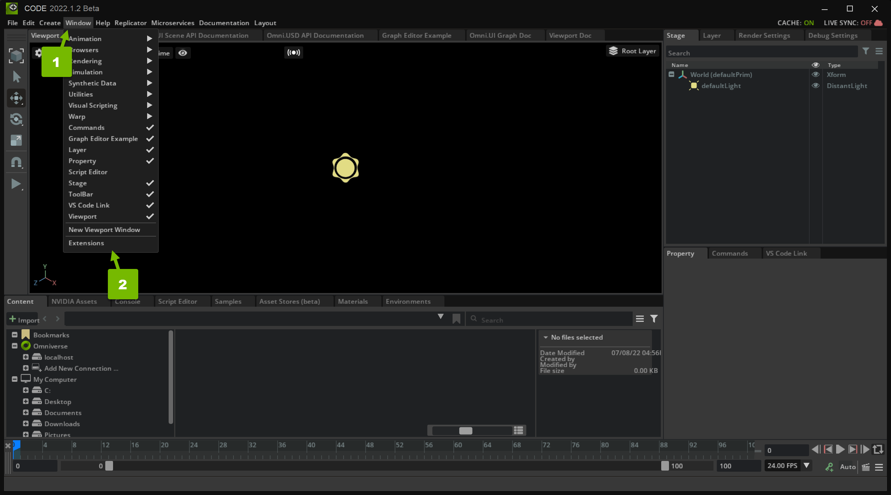
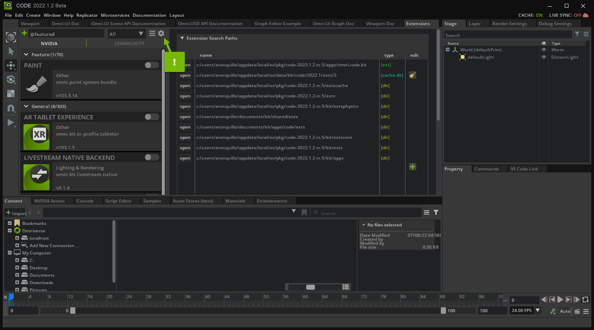

# Create a Reusable Reticle with Omniverse Kit Extensions

Camera [reticles](https://en.wikipedia.org/wiki/Reticle) are patterns and lines you use to line up a camera to a scene. In this tutorial, you learn how to make a reticle extension. You'll test it in Omniverse Code, but it can be used in any Omniverse Application.

## Learning Objectives

In this guide, you learn how to:

* Create an Omniverse Extension
* Include your Extension in Omniverse Code
* Draw a line on top of the [viewport](https://docs.omniverse.nvidia.com/app_create/prod_extensions/ext_viewport.html)
* Divide the viewport with multiple lines
* Create a crosshair and letterboxes

## Prerequisites

Before you begin, install [Omniverse Code](https://docs.omniverse.nvidia.com/app_code/app_code/overview.html) version 2022.1.2 or higher.

We recommend that you understand the concepts in the following tutorial before proceeding:

* [How to make an extension by spawning primitives](https://github.com/NVIDIA-Omniverse/sample-kit-extension-spawnPrims/blob/main/exts/omni.example.spawnPrims/tutorial/Spawn_PrimsTutorial.md)

## Step 1: Familiarize Yourself with the Starter Project

In this section, you download and familiarize yourself with the starter project you use throughout this tutorial.

### Step 1.1: Clone the Repository

Clone the `tutorial-start` branch of the `sample-kit-extension-reticle` [github repository](https://github.com/NVIDIA-Omniverse/sample-kit-extension-reticle/tree/tutorial-start):

```shell
git clone -b tutorial-start https://github.com/NVIDIA-Omniverse/sample-kit-extension-reticle.git
```

This repository contains the assets you use in this tutorial

### Step 1.2: Navigate to `views.py`

From the root directory of the project, navigate to `views.py`:

```shell
cd exts/omni.example.reticle/omni/example/reticle/views.py
```

### Step 1.3: Familiarize Yourself with `build_viewport_overlay()`

In `views.py`, navigate to `build_vieport_overlay()`:

```python
def build_viewport_overlay(self, *args):
    """Build all viewport graphics and ReticleMenu button."""
    if self.vp_win is not None:
        self.vp_win.frame.clear()
        with self.vp_win.frame:
            with ui.ZStack():
                # Set the aspect ratio policy depending if the viewport is wider than it is taller or vice versa.
                if self.vp_win.width / self.vp_win.height > self.get_aspect_ratio_flip_threshold():
                    self.scene_view = scene.SceneView(aspect_ratio_policy=scene.AspectRatioPolicy.PRESERVE_ASPECT_VERTICAL)
                else:
                    self.scene_view = scene.SceneView(aspect_ratio_policy=scene.AspectRatioPolicy.PRESERVE_ASPECT_HORIZONTAL)

                # Build all the scene view guidelines
                with self.scene_view.scene:
                    if self.model.composition_mode.as_int == CompositionGuidelines.THIRDS:
                        self._build_thirds()
                    elif self.model.composition_mode.as_int == CompositionGuidelines.QUAD:
                        self._build_quad()
                    elif self.model.composition_mode.as_int == CompositionGuidelines.CROSSHAIR:
                        self._build_crosshair()

                    if self.model.action_safe_enabled.as_bool:
                        self._build_safe_rect(self.model.action_safe_percentage.as_float / 100.0,
                                                color=cl.action_safe_default)
                    if self.model.title_safe_enabled.as_bool:
                        self._build_safe_rect(self.model.title_safe_percentage.as_float / 100.0,
                                                color=cl.title_safe_default)
                    if self.model.custom_safe_enabled.as_bool:
                        self._build_safe_rect(self.model.custom_safe_percentage.as_float / 100.0,
                                                color=cl.custom_safe_default)
                    if self.model.letterbox_enabled.as_bool:
                        self._build_letterbox()

                # Build ReticleMenu button
                with ui.VStack():
                    ui.Spacer()
                    with ui.HStack(height=0):
                        ui.Spacer()
                        self.reticle_menu = ReticleMenu(self.model)
```

Here, `self.vp_win` is the [viewport](https://docs.omniverse.nvidia.com/app_create/prod_extensions/ext_viewport.html) on which you'll build your reticle overlay. If there is no viewport, there's nothing to build on, so execution stops here:

```python
if self.vp_win is not None:
```

If there is a viewport, you create a clean slate by calling [`clear()`](https://docs.omniverse.nvidia.com/py/kit/source/extensions/omni.ui/docs/index.html#omni.ui.Container.clear) on the [frame](https://docs.omniverse.nvidia.com/py/kit/source/extensions/omni.ui/docs/index.html#omni.ui.Frame):

```python
self.vp_win.frame.clear()
```

Next, you create a [ZStack](https://docs.omniverse.nvidia.com/py/kit/source/extensions/omni.ui/docs/index.html#omni.ui.Stack): 

```python
with self.vp_win.frame:
    with ui.ZStack():
```

ZStack is a type of [Stack](https://docs.omniverse.nvidia.com/py/kit/source/extensions/omni.ui/docs/index.html#omni.ui.Stack) that orders elements along the Z axis (forward and backward from the camera, as opposed to up and down or left and right).

After that, you create a [SceneView](https://docs.omniverse.nvidia.com/py/kit/source/extensions/omni.ui.scene/docs/index.html#omni.ui_scene.scene.SceneView), a widget that renders the [Scene](https://docs.omniverse.nvidia.com/py/kit/source/extensions/omni.ui.scene/docs/index.html#omni.ui_scene.scene.Scene): 

```python
if self.vp_win.width / self.vp_win.height > self.get_aspect_ratio_flip_threshold():
    self.scene_view = scene.SceneView(aspect_ratio_policy=scene.AspectRatioPolicy.PRESERVE_ASPECT_VERTICAL)
else:
    self.scene_view = scene.SceneView(aspect_ratio_policy=scene.AspectRatioPolicy.PRESERVE_ASPECT_HORIZONTAL)
```

When doing this, you make a calculation to determine what the appropriate `aspect_ratio_policy`, which defines how to handle a [Camera](https://docs.omniverse.nvidia.com/app_create/prod_materials-and-rendering/cameras.html) with an aspect ratio different than the SceneView. The SceneView does not consider non-rendered areas such as [letterboxes](https://en.wikipedia.org/wiki/Letterboxing_(filming)), hence `get_aspect_ratio_flip_threshold()`.

Further down in `build_viewport_overlay()`, there are a number of `if` statements:

```python
with self.scene_view.scene:
    if self.model.composition_mode.as_int == CompositionGuidelines.THIRDS:
        self._build_thirds()
    elif self.model.composition_mode.as_int == CompositionGuidelines.QUAD:
        self._build_quad()
    elif self.model.composition_mode.as_int == CompositionGuidelines.CROSSHAIR:
        self._build_crosshair()

    if self.model.action_safe_enabled.as_bool:
        self._build_safe_rect(self.model.action_safe_percentage.as_float / 100.0,
                                color=cl.action_safe_default)
    if self.model.title_safe_enabled.as_bool:
        self._build_safe_rect(self.model.title_safe_percentage.as_float / 100.0,
                                color=cl.title_safe_default)
    if self.model.custom_safe_enabled.as_bool:
        self._build_safe_rect(self.model.custom_safe_percentage.as_float / 100.0,
                                color=cl.custom_safe_default)
    if self.model.letterbox_enabled.as_bool:
        self._build_letterbox()

# Build ReticleMenu button
with ui.VStack():
    ui.Spacer()
    with ui.HStack(height=0):
        ui.Spacer()
        self.reticle_menu = ReticleMenu(self.model)
```

These are the different modes and tools the user can select from the **ReticleMenu**. Throughout this tutorial, you write the logic for the following functions:

- `self._build_quad()`
- `self._build_thirds()`
- `self._build_crosshair()`
- `self._build_crosshair()`
- `_build_safe_rect()`
- `_build_letterbox()`

Before you do that, you need to import your custom Extension into Omniverse Code.

## Step 2: Import your Extension into Omniverse Code

In order to use and test your Extension, you need to add it to Omniverse Code. 

> **Important:** Make sure you're using Code version 2022.1.2 or higher.

### Step 2.1: Navigate to the Extensions List

In Omniverse Code, navigate to the *Extensions* panel:


Here, you see a list of Omniverse Extensions that you can activate and use in Code.

> **Note:** If you don't see the *Extensions* panel, enable **Window > Extensions**:
>
> 

### Step 2.2: Import your Extension

Click the **gear** icon to open *Extension Search Paths*:



In this panel, you can add your custom Extension to the Extensions list.

### Step 2.3: Create a New Search Path

Create a new search path to the `exts` directory of your Extension by clicking the green **plus** icon and double-clicking on the **path** field:


When you submit your new search path, you should be able to find your extension in the *Extensions* list. Activate it:


Now that your Extension is imported and active, you can make changes to the code and see them in your Application.

## Step 3: Draw a Single Line

The first step to building a camera reticle is drawing a line. Once you can do that, you can construct more complex shapes using the line as a foundation. For example, you can split the viewport into thirds or quads using multiple lines.

### Step 3.1: Familiarize Yourself with Some Useful Modules

At the top of `views.py`, review the following imported modules: 

```py
from omni.ui import color as cl
from omni.ui import scene
```

- `omni.ui.scene` offers color functionality.
- [`omni.ui.scene`](https://docs.omniverse.nvidia.com/py/kit/source/extensions/omni.ui.scene/docs/index.html) offers a number of useful classes including [Line](https://docs.omniverse.nvidia.com/py/kit/source/extensions/omni.ui.scene/docs/index.html#omni.ui_scene.scene.Line).

### Step 3.2: Draw a Line in `build_viewport_overlay()`

In `build_viewport_overlay()`, create a line, providing a start, stop, and color:

```python
with self.scene_view.scene:
    start_point = [0, -1, 0] # [x, y, z]
    end_point = [0, 1, 0]
    line_color = cl.white
    scene.Line(start_point, end_point, color=line_color)
```

In the Code viewport, you'll see the white line:


> **Optional Challenge:** Change the `start_point`, `end_point`, and `line_color` values to see how it renders in Code.

### Step 3.3: Remove the Line

Now that you've learned how to use `omni.ui.scene` to draw a line, remove it to prepare your viewport for more meaningful shapes.

## Step 4: Draw Quadrants

Now that you know how to draw a line, implement `_build_quad()` to construct four quadrants. In other words, split the view into four zones:


### Step 4.1: Draw Two Dividers 

Draw your quadrant dividers in `_build_quad()`:

```python
def _build_quad(self):
    """Build the scene ui graphics for the Quad composition mode."""
    aspect_ratio = self.get_aspect_ratio()
    line_color = cl.comp_lines_default
    inverse_ratio = 1 / aspect_ratio
    if self.scene_view.aspect_ratio_policy == scene.AspectRatioPolicy.PRESERVE_ASPECT_VERTICAL:
        scene.Line([0, -1, 0], [0, 1, 0], color=line_color)
        scene.Line([-aspect_ratio, 0, 0], [aspect_ratio, 0, 0], color=line_color)
    else:
        scene.Line([0, -inverse_ratio, 0], [0, inverse_ratio, 0], color=line_color)
        scene.Line([-1, 0, 0], [1, 0, 0], color=line_color)
```

To divide the viewport into quadrants, you only need two lines, so why are there four lines in this code? Imagine the aspect ratio can grow and shrink in the horizontal direction, but the vertical height is static. That would preserve the vertical aspect ratio as with [scene.AspectRatioPolicy.PRESERVE_ASPECT_VERTICAL](https://docs.omniverse.nvidia.com/py/kit/source/extensions/omni.ui.scene/docs/index.html#omni.ui_scene.scene.AspectRatioPolicy.PRESERVE_ASPECT_VERTICAL). In this case, a vertical position in the viewport is bound between `-1` and `1`, but the horizontal position bounds are determined by the aspect ratio.

Conversely, if your horizontal width bounds are static and the vertical height bounds can change, you would need the inverse of the aspect ratio (`inverse_ratio`).

### Step 4.2: Review Your Change

In Omniverse Code, select **Quad** from the **Reticle** menu:


With this option selected, the viewport is divided into quadrants.

## Step 5: Draw Thirds

The [Rule of Thirds](https://en.wikipedia.org/wiki/Rule_of_thirds) is a theory in photography that suggests the best way to align elements in an image is like this:


Like you did in the last section, here you draw a number of lines. This time, though, you use four lines to make nine zones in your viewport. But like before, these lines depend on the [Aspect Ratio Policy](https://docs.omniverse.nvidia.com/py/kit/source/extensions/omni.ui.scene/docs/index.html#omni.ui_scene.scene.AspectRatioPolicy).

### Step 5.1: Draw Four Dividers

Draw your dividers in `_build_thirds()`:

```python
def _build_thirds(self):
        """Build the scene ui graphics for the Thirds composition mode."""
        aspect_ratio = self.get_aspect_ratio()
        line_color = cl.comp_lines_default
        inverse_ratio = 1 / aspect_ratio
        if self.scene_view.aspect_ratio_policy == scene.AspectRatioPolicy.PRESERVE_ASPECT_VERTICAL:
            scene.Line([-0.333 * aspect_ratio, -1, 0], [-0.333 * aspect_ratio, 1, 0], color=line_color)
            scene.Line([0.333 * aspect_ratio, -1, 0], [0.333 * aspect_ratio, 1, 0], color=line_color)
            scene.Line([-aspect_ratio, -0.333, 0], [aspect_ratio, -0.333, 0], color=line_color)
            scene.Line([-aspect_ratio, 0.333, 0], [aspect_ratio, 0.333, 0], color=line_color)
        else:
            scene.Line([-1, -0.333 * inverse_ratio, 0], [1, -0.333 * inverse_ratio, 0], color=line_color)
            scene.Line([-1, 0.333 * inverse_ratio, 0], [1, 0.333 * inverse_ratio, 0], color=line_color)
            scene.Line([-0.333, -inverse_ratio, 0], [-0.333, inverse_ratio, 0], color=line_color)
            scene.Line([0.333, -inverse_ratio, 0], [0.333, inverse_ratio, 0], color=line_color)
```

> **Optional Challenge:** Currently, you call `scene.Line` eight times to draw four lines based on two situations. Optimize this logic so you only call `scene.Line` four times to draw four lines, regardless of the aspect ratio. 
>
> **Hint:** You may need to define new variables.
> 
> <details>
>     <summary>One Possible Solution</summary>
>
>     is_preserving_aspect_vertical = scene.AspectRatioPolicy.PRESERVE_ASPECT_VERTICAL 
>    
>     x, y = aspect_ratio, 1 if is_preserving_aspect_vertical else 1, inverse_ratio
>     x1, x2, y1, y2 = .333 * x, 1 * x, 1 * y, .333 * y
>
>     scene.Line([-x1, -y1, 0], [-x1, y1, 0], color=line_color)
>     scene.Line([x1, -y1, 0], [x1, y1, 0], color=line_color)
>     scene.Line([-x2, -y2, 0], [x2, -y2, 0], color=line_color)
>     scene.Line([-x2, y2, 0], [x2, y2, 0], color=line_color)
> </details>

### Step 5.2: Review Your Change

In Omniverse Code, select **Thirds** from the **Reticle** menu:


With this option selected, the viewport is divided into nine zones.

## Step 6: Draw a Crosshair

A crosshair is a type of reticle commonly used in [first-person shooter](https://en.wikipedia.org/wiki/First-person_shooter) games to designate a projectile's expected position. For the purposes of this tutorial, you draw a crosshair at the center of the screen.

To do this, you draw four small lines about the center of the viewport, based on the Aspect Ratio Policy.

### Step 6.1: Draw Your Crosshair

Draw your crosshair in `_build_crosshair()`:

```python
def _build_crosshair(self):
    """Build the scene ui graphics for the Crosshair composition mode."""
    aspect_ratio = self.get_aspect_ratio()
    line_color = cl.comp_lines_default
    if self.scene_view.aspect_ratio_policy == scene.AspectRatioPolicy.PRESERVE_ASPECT_VERTICAL:
        scene.Line([0, 0.05 * aspect_ratio, 0], [0, 0.1 * aspect_ratio, 0], color=line_color)
        scene.Line([0, -0.05 * aspect_ratio, 0], [0, -0.1 * aspect_ratio, 0], color=line_color)
        scene.Line([0.05 * aspect_ratio, 0, 0], [0.1 * aspect_ratio, 0, 0], color=line_color)
        scene.Line([-0.05 * aspect_ratio, 0, 0], [-0.1 * aspect_ratio, 0, 0], color=line_color)
    else:
        scene.Line([0, 0.05 * 1, 0], [0, 0.1 * 1, 0], color=line_color)
        scene.Line([0, -0.05 * 1, 0], [0, -0.1 * 1, 0], color=line_color)
        scene.Line([0.05 * 1, 0, 0], [0.1 * 1, 0, 0], color=line_color)
        scene.Line([-0.05 * 1, 0, 0], [-0.1 * 1, 0, 0], color=line_color)

    scene.Points([[0.00005, 0, 0]], sizes=[2], colors=[line_color])
```

This implementation is similar to your previous reticles except for the addition of a [point](https://docs.omniverse.nvidia.com/py/kit/source/extensions/omni.ui.scene/docs/index.html#omni.ui_scene.scene.Points) at the true center of the crosshair.

> **Optional Challenge:** Express the crosshair length as a variable.

### Step 6.2: Review Your Change

In Omniverse Code, select **Crosshair** from the **Reticle** menu:


With this option selected, the viewport shows a centered crosshair.

## Step 7: Draw Safe Area Rectangles

Different televisions or monitors may display video in different ways, cutting off the edges. To account for this, producers use [Safe Areas](https://en.wikipedia.org/wiki/Safe_area_(television)) to make sure text and graphics are rendered nicely regardless of the viewer's hardware.

In this section, you implement three rectangles:

- **Title Safe:** This helps align text so that it's not too close to the edge of the screen.
- **Action Safe:** This helps align graphics such as news tickers and logos.
- **Custom Safe:** This helps the user define their own alignment rectangle.

### Step 7.1: Draw Your Rectangle

Draw your safe [rectangle](https://docs.omniverse.nvidia.com/py/kit/source/extensions/omni.ui.scene/docs/index.html#omni.ui_scene.scene.Rectangle) in `_build_safe_rect()`:

```python
def _build_safe_rect(self, percentage, color):
    """Build the scene ui graphics for the safe area rectangle
    Args:
        percentage (float): The 0-1 percentage the render target that the rectangle should fill.
        color: The color to draw the rectangle wireframe with.
    """
    aspect_ratio = self.get_aspect_ratio()
    inverse_ratio = 1 / aspect_ratio
    if self.scene_view.aspect_ratio_policy == scene.AspectRatioPolicy.PRESERVE_ASPECT_VERTICAL:
        scene.Rectangle(aspect_ratio*2*percentage, 1*2*percentage, thickness=1, wireframe=True, color=color)
    else:
        scene.Rectangle(1*2*percentage, inverse_ratio*2*percentage, thickness=1, wireframe=True, color=color)
```

Like before, you draw two different rectangles based on how the aspect is preserved. You draw them from the center after defining the width and height. Since the center is at `[0, 0, 0]` and either the horizontal or vertical axis goes from -1 to 1 (as opposed to from 0 to 1), you multiply the width and height by two.

### Step 7.2: Review Your Change

In Omniverse Code, select your **Safe Areas** from the **Reticle** menu:


With these option selected, the viewport shows your safe areas.

## Step 8: Draw Letterboxes

[Letterboxes](https://en.wikipedia.org/wiki/Letterboxing_(filming)) are large rectangles (typically black), on the edges of a screen used to help fit an image or a movie constructed with one aspect ratio into another. It can also be used for dramatic effect to give something a more theatrical look.

### Step 8.1 Draw Your Letterbox Helper

Write a function to draw and place a [rectangle](https://docs.omniverse.nvidia.com/py/kit/source/extensions/omni.ui.scene/docs/index.html#omni.ui_scene.scene.Rectangle):

```python
def _build_letterbox(self):
    def build_letterbox_helper(width, height, x_offset, y_offset):
        move = scene.Matrix44.get_translation_matrix(x_offset, y_offset, 0)
        with scene.Transform(transform=move):
            scene.Rectangle(width * 2, height * 2, thickness=0, wireframe=False, color=letterbox_color)
        move = scene.Matrix44.get_translation_matrix(-x_offset, -y_offset, 0)
        with scene.Transform(transform=move):
            scene.Rectangle(width * 2, height * 2, thickness=0, wireframe=False, color=letterbox_color)
```

The [scene.Matrix44.get_translation_matrix](https://docs.omniverse.nvidia.com/py/kit/source/extensions/omni.ui.scene/docs/index.html#omni.ui_scene.scene.Matrix44.get_translation_matrix) creates a 4x4 matrix that can be multiplied with a point to offset it by an x, y, or z amount. Since you don't need to move your rectangles toward or away from the camera, the z value is 0.

> **Further Reading:** To learn more about the math behind this operation, please check out [this article](https://medium.com/swlh/understanding-3d-matrix-transforms-with-pixijs-c76da3f8bd8).

`build_letterbox_helper()` first defines the coordinates of where you expect to rectangle to be placed with `move`. Then, it creates a rectangle with that [transform](https://medium.com/swlh/understanding-3d-matrix-transforms-with-pixijs-c76da3f8bd8). Finally, it repeats the same steps to place and create a rectangle in the opposite direction of the first.

Now that you have your helper function, you it to construct your letterboxes.

### Step 8.2: Review Your Potential Aspect Ratios

Consider the following situations:


In this case, the viewport height is static, but the horizontal width can change. Additionally, the letterbox ratio is larger than the aspect ratio, meaning the rendered area is just as wide as the viewport, but not as tall.

Next, write your logic to handle this case.

### Step 8.3: Build Your First Letterbox

Build your letterbox to handle the case you analyzed in the last step:

```python
def _build_letterbox(self):
    """Build the scene ui graphics for the letterbox."""
    aspect_ratio = self.get_aspect_ratio()
    letterbox_color = cl.letterbox_default
    letterbox_ratio = self.model.letterbox_ratio.as_float

    def build_letterbox_helper(width, height, x_offset, y_offset):
        move = scene.Matrix44.get_translation_matrix(x_offset, y_offset, 0)
        with scene.Transform(transform=move):
            scene.Rectangle(width * 2, height * 2, thickness=0, wireframe=False, color=letterbox_color)
        move = scene.Matrix44.get_translation_matrix(-x_offset, -y_offset, 0)
        with scene.Transform(transform=move):
            scene.Rectangle(width * 2, height * 2, thickness=0, wireframe=False, color=letterbox_color)

    if self.scene_view.aspect_ratio_policy == scene.AspectRatioPolicy.PRESERVE_ASPECT_VERTICAL:
        if letterbox_ratio >= aspect_ratio:
            height = 1 - aspect_ratio / letterbox_ratio
            rect_height = height / 2
            rect_offset = 1 - rect_height
            build_letterbox_helper(aspect_ratio, rect_height, 0, rect_offset)
```

Here, you can think of the `height` calculated above as the percentage of the viewport height to be covered by the letterboxes. If the `aspect_ratio` is 2 to 1, but the `letterbox_ratio` is 4 to 1, then `aspect_ratio / letterbox_ratio` is .5, meaning the letterboxes will cover half of the height.

However, this is split by both the top and bottom letterboxes, so you divide the `height` by 2 to get the rectangle height (`rect_height`), which, with our example above, is .25.

Now that you know the height of the rectangle, you need to know where to place it. Thankfully, the vertical height is bound from -1 to 1, and since you're mirroring the letterboxes along both the top and bottom, so you can subtract `rect_height` from the maximum viewport height (1).

### Step 8.4: Build The Other Letterboxes

Using  math similar to that explained in the last step, write the `_build_letterbox()` logic for the other three cases:

```python
def _build_letterbox(self):
    """Build the scene ui graphics for the letterbox."""
    aspect_ratio = self.get_aspect_ratio()
    letterbox_color = cl.letterbox_default
    letterbox_ratio = self.model.letterbox_ratio.as_float

    def build_letterbox_helper(width, height, x_offset, y_offset):
        move = scene.Matrix44.get_translation_matrix(x_offset, y_offset, 0)
        with scene.Transform(transform=move):
            scene.Rectangle(width * 2, height * 2, thickness=0, wireframe=False, color=letterbox_color)
        move = scene.Matrix44.get_translation_matrix(-x_offset, -y_offset, 0)
        with scene.Transform(transform=move):
            scene.Rectangle(width * 2, height * 2, thickness=0, wireframe=False, color=letterbox_color)

    if self.scene_view.aspect_ratio_policy == scene.AspectRatioPolicy.PRESERVE_ASPECT_VERTICAL:
        if letterbox_ratio >= aspect_ratio:
            height = 1 - aspect_ratio / letterbox_ratio
            rect_height = height / 2
            rect_offset = 1 - rect_height
            build_letterbox_helper(aspect_ratio, rect_height, 0, rect_offset)
        else:
            width = aspect_ratio - letterbox_ratio
            rect_width = width / 2
            rect_offset = aspect_ratio - rect_width
            build_letterbox_helper(rect_width, 1, rect_offset, 0)
    else:
        inverse_ratio = 1 / aspect_ratio
        if letterbox_ratio >= aspect_ratio:
            height = inverse_ratio - 1 / letterbox_ratio
            rect_height = height / 2
            rect_offset = inverse_ratio - rect_height
            build_letterbox_helper(1, rect_height, 0, rect_offset)
        else:
            width = (aspect_ratio - letterbox_ratio) * inverse_ratio
            rect_width = width / 2
            rect_offset = 1 - rect_width
            build_letterbox_helper(rect_width, inverse_ratio, rect_offset, 0)
```

## 8. Congratulations!

Great job completing this tutorial! Interested in improving your skills further? Check out the [Omni.ui.scene Example](https://github.com/NVIDIA-Omniverse/kit-extension-sample-ui-scene).

